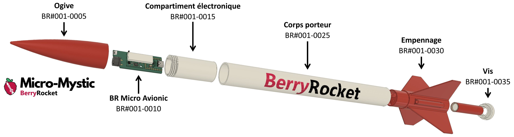

# BerryRocket Micro-Mystic

This is the official repository for BerrRocket Micro-Mystic.
It contains every file to start your micro rocket ! 
You can use file as-is to clone the model (with STL file and a 3D printer) or you can modify parts of the rocket with STEP files included.
See [wiki of BerryRocket](https://berryrocket.com/wiki) to have more information.

# Licence CC BY-NC-SA 4.0

